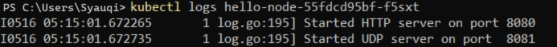
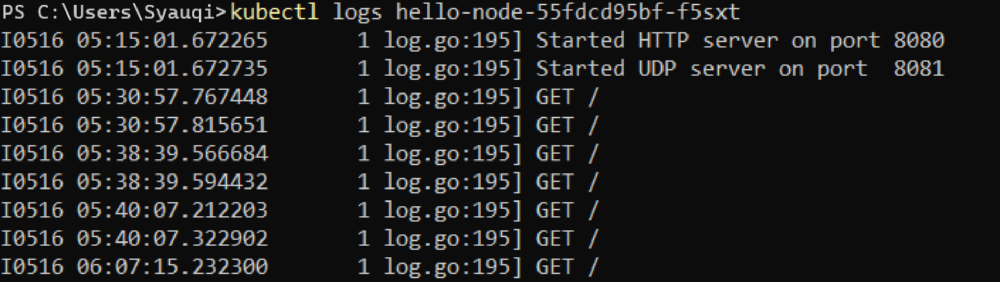
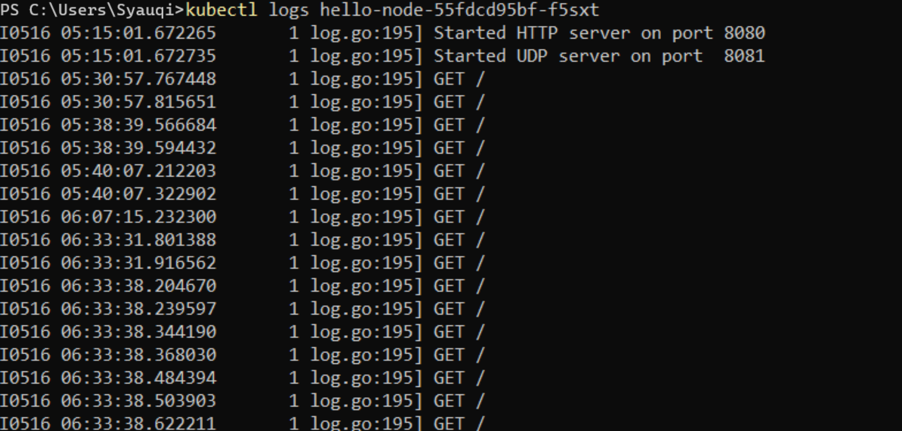

## Reflection On Hello Minikube

1. Saat saya memeriksa log sebelum dan setelah aplikasi diekspos sebagai layanan, saya menemukan perbedaan dalam isi log tersebut. Sebelum aplikasi diekspos, log hanya mencatat bahwa server HTTP dan UDP telah dimulai pada port 8080. Namun, setelah aplikasi diekspos, log menunjukkan berbagai riwayat permintaan HTTP GET. Menurut pengamatan saya, hal ini terjadi karena setiap kali saya membuka aplikasi dan me-refresh halaman web, log mencatat permintaan HTTP GET tambahan. Berikut adalah lampiran dari percobaan tersebut:

2. Dalam perintah kubectl, opsi -n digunakan untuk menentukan namespace tertentu di cluster Kubernetes. Namespace di Kubernetes berfungsi memisahkan objek dalam kluster agar sumber daya lebih terorganisir dan terisolasi. Misalnya, jika Anda menggunakan opsi -n kube-system, perintah kubectl get hanya akan menampilkan objek yang berada di namespace kube-system. Alasan output tidak menunjukkan pods atau layanan secara eksplisit adalah karena sumber daya tersebut kemungkinan besar dibuat di namespace lain.